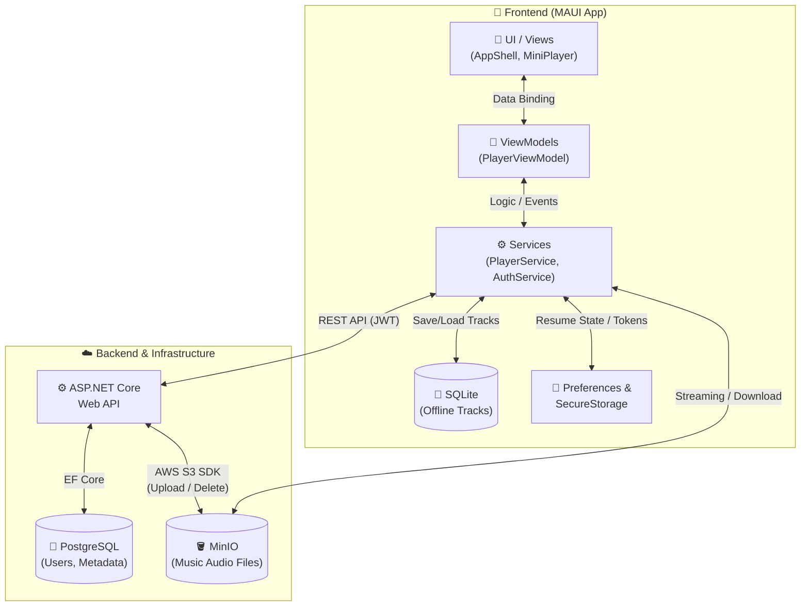

<div align="center">

# 🎵 Music Application

<br>

[](https://dotnet.microsoft.com/en-us/apps/maui)
[](https://dotnet.microsoft.com/)
[](https://www.postgresql.org/)
[](https://min.io/)
<br>


</div>

---

## 📑 Mục lục

- [💡 Giới thiệu dự án](#-giới-thiệu-dự-án)
- [🎯 Bài toán & Giải pháp](#-bài-toán--giải-pháp)
- [⚡ Tổng quan nhanh](#-tổng-quan-nhanh)
- [🗺️ Sơ đồ kiến trúc tổng thể](#️-sơ-đồ-kiến-trúc-tổng-thể)
- [✨ Tính năng nổi bật](#-tính-năng-nổi-bật)
- [📂 Cấu trúc thư mục](#-cấu-trúc-thư-mục)
- [🚀 Hướng dẫn cài đặt & Triển khai](#-hướng-dẫn-cài-đặt--triển-khai)
- [🤝 Lời ngỏ & Đóng góp](#-lời-ngỏ--đóng-góp)

---

## 💡 Giới thiệu dự án

**Music Application** là một dự án cá nhân nhằm thực hành xây dựng một hệ thống nghe nhạc hoàn chỉnh trên hệ sinh thái .NET (.NET MAUI & ASP.NET Core).

Thay vì sử dụng các bộ phát nhạc đơn giản có sẵn, dự án này tự xây dựng luồng xử lý riêng để giải quyết 3 bài toán cơ bản: Phát nhạc trực tiếp từ server (Streaming), quản lý bài hát ngoại tuyến (Offline qua SQLite), và lưu trữ trạng thái người dùng (Resume State). Đồng thời, hệ thống Backend cũng được phát triển độc lập với RESTful API, xác thực JWT, cơ sở dữ liệu PostgreSQL và tích hợp Docker MinIO (Object Storage). Qua đó, dự án tập trung làm rõ việc áp dụng kiến trúc MVVM, cách xử lý Media trên Mobile, và sự tương tác đồng bộ giữa Client - Server.

---

## 🎯 Các bài toán kỹ thuật đã xử lý

| Hạng mục kỹ thuật | Cách tiếp cận & Xử lý trong dự án |
|-------------------|-----------------------------------|
| 📡 **Quản lý luồng phát (Streaming)** | Tránh việc tải toàn bộ dung lượng file audio vào RAM gây giật lag. Hệ thống sử dụng cơ chế phát luồng trực tiếp từ URL của Cloud Storage, giúp nhạc phát ngay lập tức và tiết kiệm tối đa bộ nhớ thiết bị. |
| 🔄 **Lưu trạng thái (Resume State)** | Tự động ghi nhớ bài hát và thời gian đang nghe dở vào vùng lưu trữ thiết lập cục bộ của hệ điều hành (Key-Value Storage) theo chu kỳ 3s/lần. Khi mở lại app, hệ thống lắng nghe sự kiện để tự động tua về đúng vị trí cũ. |
| 📴 **Chế độ Ngoại tuyến (Offline)** | Tích hợp cơ sở dữ liệu cục bộ (`SQLite`) ở Frontend để quản lý danh sách tải xuống. Logic trình phát tự động nhận diện và chuyển đổi linh hoạt giữa nguồn nhạc mạng và nguồn file lưu trong máy. |
| 🔐 **Xác thực & Bảo mật** | Áp dụng cơ chế xác thực JWT kết hợp mã làm mới (Refresh Token Rotation). Tích hợp bộ chặn HTTP (HTTP Interceptor) để tự động đính kèm Token và làm mới phiên làm việc ngầm khi hết hạn, giúp duy trì trạng thái đăng nhập liên tục. |

---

## ⚡ Tổng quan nhanh

<div align="center">

| Hạng mục | Nền tảng / Công nghệ |
|:---------|:--------|
| 📱 **Nền tảng Frontend** | .NET MAUI 8.0 (Android) |
| 🎨 **Kiến trúc App** | MVVM (Model - View - ViewModel) |
| 💾 **Lưu trữ cục bộ (Offline)** | SQLite (`sqlite-net-pcl`) + Key-Value Storage (`Preferences`) |
| ⚙️ **Backend API** | ASP.NET Core 8.0 (Web API + Entity Framework Core) |
| 🐘 **Cơ sở dữ liệu hệ thống** | PostgreSQL 16 |
| ☁️ **Lưu trữ tệp Media** | MinIO |
| 🔐 **Cơ chế xác thực** | JWT Access Token & Refresh Token Rotation |

</div>

---

## 🗺️ Sơ đồ kiến trúc tổng thể



> 💡 **Tóm tắt 3 luồng hoạt động chính:**
> 1. **Luồng Xác thực & Dữ liệu (Metadata):** `Frontend` ↔ `Web API` ↔ `PostgreSQL` (Quản lý tài khoản, JWT Token, danh sách Playlist và bài hát).
> 2. **Luồng Quản lý Media (Upload/Delete):** `Web API` ↔ `MinIO` (Xử lý upload/xóa file nhạc trực tiếp bằng AWS S3 SDK).
> 3. **Luồng Phát nhạc & Tải về (Streaming/Download):** `Frontend` ↔ `MinIO` & `SQLite` (Stream audio trực tiếp từ MinIO để giảm tải băng thông Web API; lưu nhạc ngoại tuyến vào máy và quản lý danh sách qua SQLite).

---

## ✨ Tính năng chính

<table>
<tr>
<td width="50%" valign="top">

### 🎧 Streaming & Offline
- **Phát đa nguồn (Multi-source):** Tự động chuyển đổi linh hoạt giữa nguồn phát trực tuyến (`MediaSource.FromUri`) và nguồn tệp cục bộ (`MediaSource.FromFile`).
- **Trình phát toàn cục (Persistent Player):** Giữ luồng phát âm thanh liên tục không bị gián đoạn khi người dùng điều hướng qua lại giữa các màn hình khác nhau trong ứng dụng.
- **Đồng bộ thời gian tua (Seek Synchronization):** Tránh xung đột dữ liệu giữa thao tác kéo thanh thời gian của người dùng và tiến trình thực của trình phát, loại bỏ hiện tượng giật/nhảy con trỏ (slider jitter).

</td>
<td width="50%" valign="top">

### 🔄 Khôi phục trạng thái (State Persistence)
- **Tự động lưu vị trí (Auto Save):** Định kỳ lưu thông tin bài hát và thời gian phát hiện tại vào bộ nhớ cục bộ (`Preferences`) theo chu kỳ 3s.
- **Tự động khôi phục (Auto Resume):** Tự động nạp lại bài hát và tua (`SeekTo`) về vị trí dở dang gần nhất ngay khi trình phát hoàn tất khởi tạo.

</td>
</tr>
<tr>
<td width="50%" valign="top">

### 👤 Xác thực & Định danh
- **Lưu trữ bảo mật:** Lưu trữ Token và thông tin định danh vào bộ nhớ mã hóa của hệ điều hành (`SecureStorage`).
- **Tự động đăng nhập (Auto Login):** Kiểm tra hiệu lực của Token khi khởi động ứng dụng để điều hướng trực tiếp vào giao diện chính.
- **Quản lý tài khoản:** Cung cấp đầy đủ các chức năng Đăng ký, Đăng nhập, Đổi mật khẩu và Quản lý hồ sơ cá nhân.

</td>
<td width="50%" valign="top">

### 📚 Quản lý Thư viện Nhạc
- **Truy vấn danh sách:** Truy xuất danh sách bài hát, nghệ sĩ và danh sách phát (Playlist) từ máy chủ Backend.
- **Quản lý nhạc ngoại tuyến:** Sử dụng cơ sở dữ liệu `SQLite` tại thiết bị để lưu trữ và truy vấn danh mục các bài hát đã tải xuống.

</td>
</tr>
</table>

---

## 📂 Cấu trúc thư mục

### 📱 Frontend (`MusicApplication/`)
```text
MusicApplication/
├── 📁 Models/            # Các lớp dữ liệu chuẩn hóa (Track, Playlist, DownloadedTrack, User...)
├── 📁 ViewModels/        # Tầng trung gian MVVM xử lý Data Binding (PlayerViewModel, MainViewModel, LibraryViewModel...)
├── 📁 Services/          # Lớp dịch vụ xử lý ngầm (AuthInterceptor, PlayerService, DownloadService, AuthService...)
├── 📁 ManagePage/        # Màn hình quản lý điều hướng & xác thực (HomePage, LoginPage, RegisterPage)
├── 📁 PersonalPages/     # Màn hình chức năng chính (FullPlayerPage, LibraryPage, MiniPlayerView, PlaylistPage...)
├── 📁 Platforms/         # Mã nguồn & Cấu hình đặc thù từng nền tảng (Android, iOS, Windows, MacCatalyst)
├── 📁 Resources/         # Tài nguyên ứng dụng (AppIcon, Fonts, Images, Styles)
├── 📄 App.xaml           # Khai báo tài nguyên toàn cục & khởi tạo ứng dụng
├── 📄 AppShell.xaml      # Cấu hình định tuyến chính (Shell Navigation)
├── 📄 MainPage.xaml      # Màn hình giao diện chính
├── 📄 PersonalPage.xaml  # Màn hình trang cá nhân
├── 📄 SearchPage.xaml    # Màn hình tìm kiếm bài hát
└── 📄 MauiProgram.cs     # Điểm khởi chạy ứng dụng & đăng ký Dependency Injection (DI)
```

### ⚙️ Backend (`MusicAppBackend/`)
```text
MusicAppBackend/
├── 📁 Controllers/       # Các Endpoint API xử lý yêu cầu HTTP (AuthController, TracksController, PlaylistController...)
├── 📁 Data/              # Cấu hình DbContext kết nối cơ sở dữ liệu PostgreSQL (AppDbContext)
├── 📁 Models/            # Các đối tượng thực thể Entity Framework (User, Track, Playlist...)
├── 📁 Repositories/      # Tầng truy xuất dữ liệu trực tiếp từ Database (TrackRepository, UserRepository...)
├── 📁 Services/          # Lớp nghiệp vụ xử lý logic chính (AuthService, JwtHelper, S3Service, TrackService...)
├── 📄 appsettings.json   # Cấu hình chuỗi kết nối Database, JWT Key và thông số MinIO S3
└── 📄 Program.cs         # Cấu hình Middleware, cài đặt Authentication/Authorization & đăng ký DI
```

---

## 🚀 Hướng dẫn cài đặt & Triển khai cục bộ (Local Deployment)

### Bước 1: Khởi động MinIO Server (Object Storage)
1. **Khởi chạy MinIO Container:**
Yêu cầu hệ thống đã cài đặt Docker Desktop. Thực thi lệnh khởi chạy MinIO Server với biến môi trường định danh root (thay thế `/path/to/minio/data` bằng đường dẫn thực tế trên máy):
```bash
docker run -d --name minio-server \
  -p 9000:9000 -p 9001:9001 \
  -e "MINIO_ROOT_USER=minioadmin" \
  -e "MINIO_ROOT_PASSWORD=minioadmin" \
  -v /path/to/minio/data:/data \
  minio/minio server /data --console-address ":9001"
```

2. **Tạo Bucket & Cấu hình Quyền truy cập bằng MinIO Client (`mc`):**
Thực thi chuỗi lệnh `mc` (MinIO Client) để tự động hóa việc khởi tạo Bucket và cấp quyền tải công khai cho tệp âm thanh:
```bash
# 1. Khởi tạo Alias kết nối tới MinIO Server cục bộ
docker exec minio-server mc alias set localminio http://localhost:9000 minioadmin minioadmin

# 2. Tạo Bucket 'music-storage' (trùng khớp với thuộc tính BucketName trong appsettings.json)
docker exec minio-server mc mb localminio/music-storage

# 3. Phân quyền đọc/tải công khai (anonymous download) cho Bucket 'music-storage'
docker exec minio-server mc anonymous set download localminio/music-storage
```
> *Ghi chú:* Quyền `download` cho phép thiết bị di động đọc và stream tệp MP3 trực tiếp qua HTTP mà không bị lỗi từ chối quyền (403 Forbidden).

> ⚠️ **Cấu hình Firewall cho Mạng Cục Bộ (Local Network):**
> Để các thiết bị di động thật thử nghiệm trong cùng mạng Wi-Fi LAN có thể kết nối tới cổng 9000, mở PowerShell với quyền Administrator và thực thi lệnh mở cổng giới hạn trong mạng nội bộ (Private Profile):
> ```powershell
> # Mở Port 9000 chỉ cho phạm vi Mạng Cục Bộ (Private Profile)
> New-NetFirewallRule -DisplayName "MinIO MusicApp (Port 9000)" -Direction Inbound -LocalPort 9000 -Protocol TCP -Action Allow -Profile Private
> ```
> 
> **Lệnh đóng/xóa Firewall Rule (Thực thi khi hoàn tất thử nghiệm):**
> ```powershell
> # Xóa Rule đã tạo để đảm bảo an toàn hệ thống
> Remove-NetFirewallRule -DisplayName "MinIO MusicApp (Port 9000)"
> ```
> 
> 💡 **Lưu ý đối với Android Emulator (Máy ảo):**
> - Khi chạy trên Máy ảo Android (Android Emulator), địa chỉ đại diện cho máy chủ Host (localhost) là `10.0.2.2` (Ví dụ: `http://10.0.2.2:5296/` cho Backend API và `http://10.0.2.2:9000` cho MinIO).
> - Giao tiếp giữa Máy ảo và máy Host diễn ra qua giao diện loopback nội bộ của môi trường lập trình, do đó **không cần mở Port 9000** trên Windows Firewall.

### Bước 2: Thao tác cấu hình Backend
1. Tạo tệp (hoặc cập nhật) `MusicAppBackend/appsettings.json` theo mẫu cấu hình bên dưới:

```json
{
  "Logging": {
    "LogLevel": {
      "Default": "Information",
      "Microsoft.AspNetCore": "Warning"
    }
  },
  "AllowedHosts": "*",
  "ConnectionStrings": {
    "DefaultConnection": "Host=localhost;Port=5432;Database=MobileMusicAppDb;Username=YOUR_POSTGRES_USER;Password=YOUR_POSTGRES_PASSWORD"
  },
  "Jwt": {
    "Key": "YOUR_SUPER_SECRET_JWT_KEY_AT_LEAST_32_CHARS",
    "Issuer": "MusicAppBackend"
  },
  "AWS": {
    "AccessKey": "minioadmin",
    "SecretKey": "minioadmin",
    "BucketName": "music-storage",
    "ServiceURL": "http://192.168.1.x:9000"
  }
}
```

2. Khởi chạy ứng dụng Backend:
```bash
dotnet run --project MusicAppBackend
```

### Bước 3: Thao tác cấu hình Frontend
Trong file `MusicApplication/MauiProgram.cs`, cập nhật địa chỉ IP LAN của máy chủ Backend cho `HttpClient`:
```csharp
builder.Services.AddSingleton<HttpClient>(sp => new HttpClient
{
    BaseAddress = new Uri("http://192.168.1.x:5296/")
});
```

### Bước 4: Biên dịch và Thực thi
Lựa chọn thiết bị đích (Máy ảo Android Emulator, Thiết bị di động thử nghiệm hoặc Windows Machine) và tiến hành biên dịch dự án `MusicApplication`.

---

## 🤝 Đóng góp & Phát triển

Dự án được xây dựng nhằm mục đích thử nghiệm và thực hành triển khai ứng dụng đa nền tảng kết hợp các dịch vụ lưu trữ độc lập.

Các đóng góp mã nguồn (Pull Request) nhằm cải thiện kiến trúc hoặc khắc phục sự cố kỹ thuật đều được xem xét và ghi nhận.
